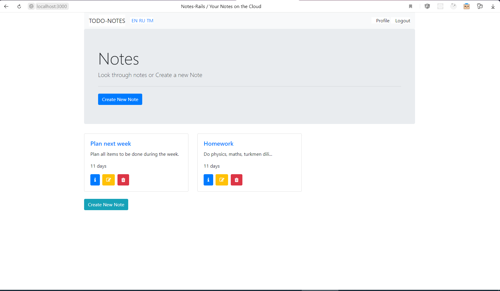
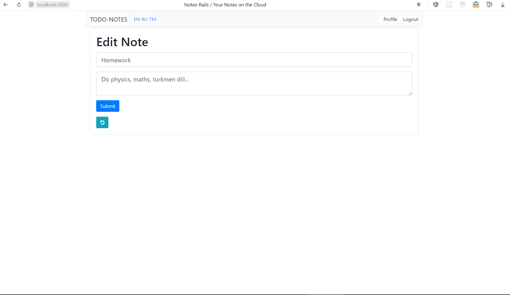

# Rails-Notes
Notes app, implemented in Rails only (+ Bootstrap)

Author : Merdan Durdyýew  
Github : https://github.com/eminarium  
Medium (Personal blog) : https://merdan-durdiyev.medium.com/   
Medium (Publication / Turkmen content) : https://medium.com/kodeser  
Medium (Publication / English content) : https://medium.com/kode-art  
Dev.to : https://dev.to/eminarium  
Date : 05.12.2020  
  
Beýany: "Notes App" - Adaty Rails esbaplary bilen ýazylan, Bootstrap we HAML    
elementleri bilen bezelen, bellikler sanawy priloženiýasy.    
Ulanylan esbaplar aşakda görkezilen.  
  
Description : "Notes App" - a web app developed with bare Rails tools and  
Bootstrap + HAML for decoration.  
List of extra tools used are shown below.  
  
    
Database: Postgres  

Gems used:  
- Devise (for authentication)  
- friendly_id (for slug)  
- rails-i18n (for translation/ :en, :ru, :tm locales used)  
- haml (for friendly markup)  
- simple_form (for simple form markup)  

  

  
Screenshot:

All Notes  
  
  
  
Editing a Note  
  
  
  
  

Instructions:
- Install Rails (You can install Bitnami Rubystack)
https://bitnami.com/stack/ruby/installer  
- Run "bundle install" command in the project folder.  
- Run rails server => "rails s"  
- Open link "http://localhost:3000" on you computer (in the browser).  

# Good Luck!
